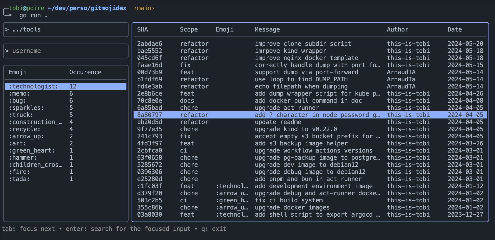

# Gitmojidex :mag:

Interactive CLI tool to visualize gitmojis informations.
It will parse git files for a given path to retrieve commit history and display them into the terminal.



> *__Note:__ By default, it will try to parse the working directory.*

## Development

### Prerequisites

Install :
- [Go](https://go.dev/doc/install)

### Run

```sh
# Clone this repository
git clone https://github.com/this-is-tobi/gitmojidex && cd gitmojidex

# Start the CLI
go run .
```
