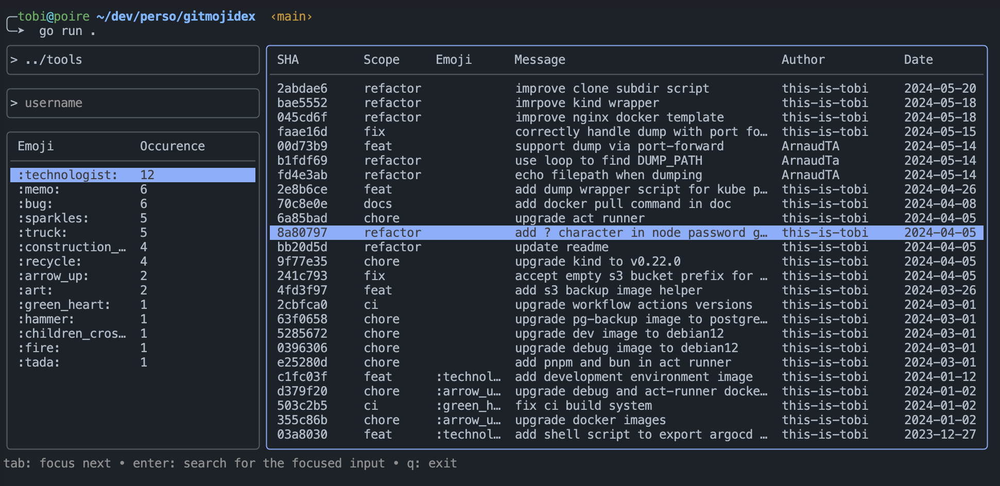

# Gitmojidex :mag:

Interactive CLI tool built with [Bubbletea](https://github.com/charmbracelet/bubbletea) to visualize gitmoji information.
It parses git history for a repository and renders commit statistics in a terminal UI.



> *__Note:__ By default, it will try to parse the working directory.*

## Development

### Prerequisites

Install:
- Go 1.25 or later (`go` toolchain)

### Build & Run

Clone and build:

```sh
git clone https://github.com/this-is-tobi/gitmojidex && cd gitmojidex
go build -o gitmojidex
```

Run the built binary:

```sh
./gitmojidex --path ./ --user ""      # run with defaults
./gitmojidex --emojiless              # disable emoji rendering (useful in some terminals)
```

You can also use `go run` while developing:

```sh
go run . --emojiless
```

### Flags

- `-p, --path` : Path to the git repository (default `./`).
- `-u, --user` : Filter commits by author using a regex.
- `-e, --emojiless` : Disable emoji rendering in the UI (falls back to shortnames). Useful if your terminal does not support ZWJ/emoji composition.

### Notes

- Some terminals (notably older VS Code integrated terminals) may render combined emoji sequences differently which can affect box-drawing alignment. If you notice broken borders, try running the binary in Terminal.app or iTerm2, or use the `--emojiless` flag.

